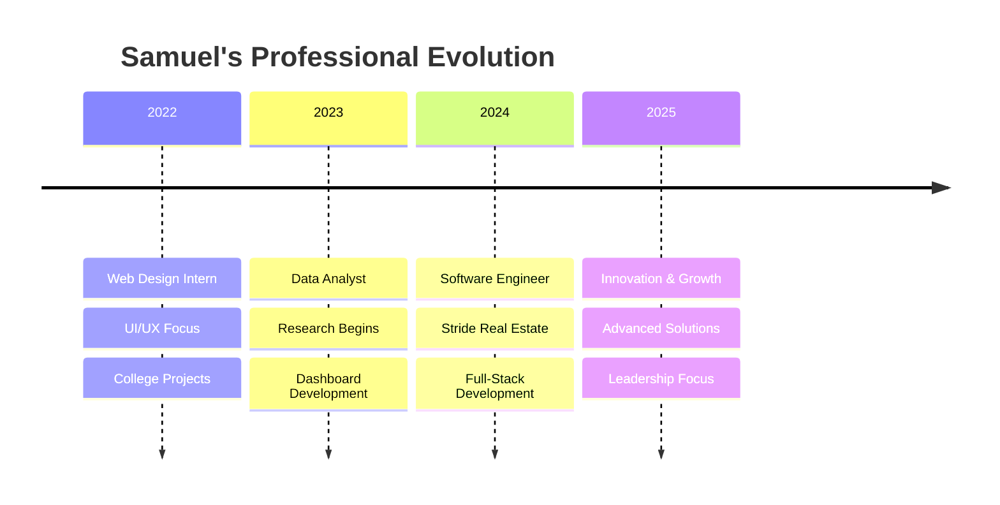

# 

<div align="center">
  
</div>

<div align="center">
  
  [](https://git.io/typing-svg)
  
</div>

<div align="center">
  
</div>

---

## 🎯 **Quick Snapshot** 

<table>
<tr>
<td width="50%">

### 💼 **Current Role**
```typescript
const currentPosition = {
  company: "Stride Real Estate",
  role: "Software Engineer",
  location: "Remote, USA",
  impact: {
    clientEngagement: "+30%",
    dropOffReduction: "-15%",
    customerInquiries: "+20%"
  },
  startDate: "March 2024"
};
```

</td>
<td width="50%">

### 🎓 **Research Background**
```python
research_profile = {
    "institution": "IIIT Hyderabad",
    "focus": ["NLP", "LLM Fine-tuning"],
    "domain": "Sanskrit Translation",
    "technologies": ["Python", "TensorFlow"],
    "status": "Active Researcher"
}
```

</td>
</tr>
</table>

<div align="center">
  
[](https://linkedin.com/in/samuelrodrigues-03/)
[](mailto:samuel.rodrigues.works@gmail.com)
[](https://github.com/CodeWithSammy)

</div>

---

## 🔥 **Tech Arsenal & Expertise**

<div align="center">

### 🎨 **Frontend Mastery**


### ⚡ **Backend & Cloud**


### 🗄️ **Database & Tools**


</div>

<div align="center">
  
</div>

---

## 📊 **Performance Metrics**

<div align="center">
<table>
<tr>
<td align="center" width="50%">


</td>
<td align="center" width="50%">


</td>
</tr>
</table>
</div>

<div align="center">
  
</div>

---

## 🏆 **Hall of Fame**

<div align="center">

| 🎯 **Achievement** | 📈 **Impact** | 🎪 **Event** |
|:------------------:|:-------------:|:-------------:|
| 🥇 **Top 10/200+** | National Recognition | Hackathon Championship |
| 🥈 **2nd Place** | Innovation Award | Collaborative Dev Challenge |
| 🏅 **SIH Finalist** | Cleared 3 Rounds | Smart India Hackathon |
| 📊 **+30% Engagement** | Business Growth | Stride Real Estate |
| 🎯 **-15% Drop-off** | UX Excellence | Career Platform |

</div>

---

## 🚀 **Professional Journey**

<div align="center">



</div>

---

## 💎 **Featured Masterpieces**

<div align="center">
<table>
<tr>
<td align="center" width="33%">

### 🏠 **Mortgage Platform**
*React • AWS • Tailwind*

[](https://github.com/CodeWithSammy)

**Impact:** 30% ↑ Engagement

</td>
<td align="center" width="33%">

### 💼 **Career Portal**
*React • Firebase • PostgreSQL*

[](https://github.com/CodeWithSammy)

**Impact:** 15% ↓ Drop-off

</td>
<td align="center" width="33%">

### 🏛️ **Title Company Site**
*React • Google APIs • Maps*

[](https://github.com/CodeWithSammy)

**Impact:** 20% ↑ Inquiries

</td>
</tr>
</table>
</div>

---

## 🎪 **Fun Zone**

<div align="center">

### 🎯 **Coding Activity**


### 🏃‍♂️ **Productivity Pulse**


</div>

---

## 🌟 **Connect & Collaborate**

<div align="center">

[](https://discord.com)

</div>

<div align="center">
  
### 🎵 **Currently Vibing To**
[](https://spotify.com)

</div>

---

## 📈 **What's Next?**

<div align="center">

```javascript
const futureGoals = {
  immediate: ["Advanced React Patterns", "Microservices Architecture"],
  shortTerm: ["Technical Leadership", "Open Source Contributions"],
  longTerm: ["Product Innovation", "Mentoring Developers"],
  dream: "Building products that impact millions of users worldwide"
};

console.log("🚀 Ready to turn ambitious ideas into reality!");
```

</div>

---

<div align="center">
  
  [](https://github.com/CodeWithSammy)
  [](https://github.com/CodeWithSammy?tab=followers)
  [](https://github.com/CodeWithSammy)

</div>

<div align="center">
  
  **💫 "Code is poetry written in logic, and I'm here to create masterpieces!"**
  
</div>

<div align="center">
  
</div>

---

<div align="center">
  
</div>
